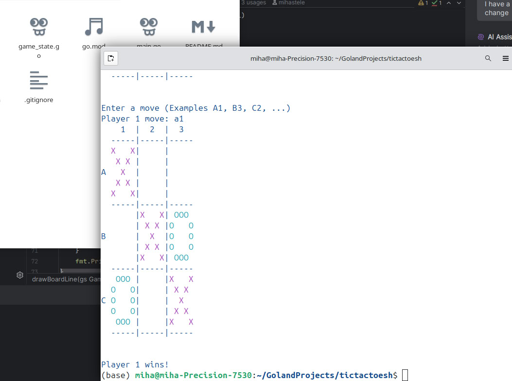

# Tic Tac Toe CLI Game in Go

This is a simple command-line Tic Tac Toe game written in Go. Play against yourself or another player directly in the terminal. The game supports two players, with a turn-based system, and automatically detects wins or ties.

---

## Features
- Play Tic Tac Toe in the terminal
- Customizable player colors and terminal text color (optional)

---

## How to Play

1. Clone or download the repository.
2. Run the game:
   ```bash
   go build
   ./tictactoesh
   ```

3. Follow the prompts to set player colors and make moves.

4. The game will automatically detect the winner or a tie.

---

## Demo



---

## License

MIT

---
